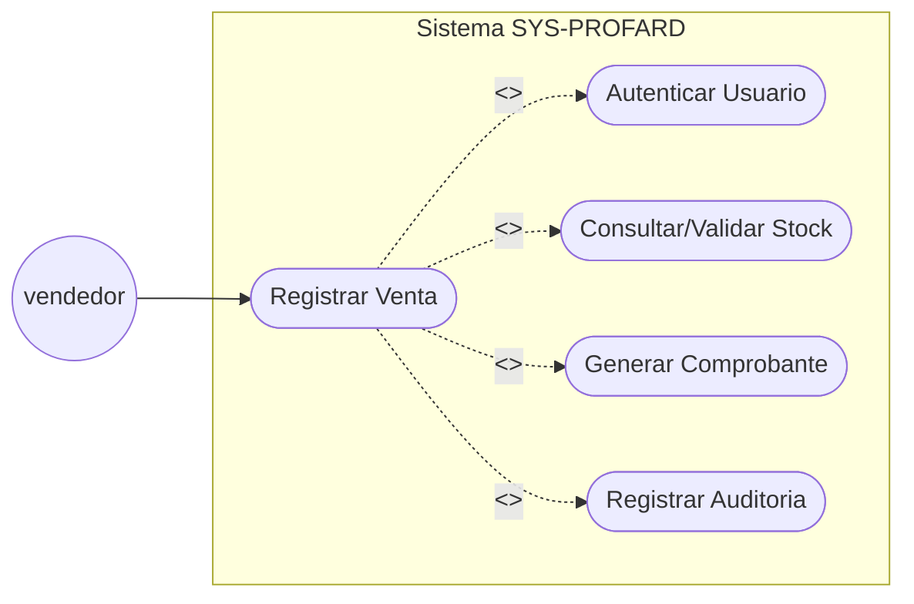

# Diagramas de comportamiento - SYS PROFAR

## Caso de uso: Registrar Venta

### Diagrama de Caso de uso

Fuente: [`2-MODELO_UML/Comportamiento/1-Casos_Uso/CU01-registrar-venta.puml`](2-MODELO_UML/Comportamiento/1-Casos_Uso/CU01-registrar-venta.puml)

### Especificación

| Campo | Detalle |
|-------|---------|
| **Id** | CU-01 |
| **Actores primarios** | Vendedor (sucursal/central) |
| **Actores secundarios** | SUNAT (Servicio externo de facturación), Base de Datos de Auditoría |

**Breve descripción:** El sistema permite al vendedor registrar una transacción de venta, descontar stock de inventario, emitir el comprobante y auditar la operación.

**Precondiciones:**
- El vendedor ha iniciado sesión exitosamente.
- El cliente está registrado o se dispone de sus datos (DNI/RUC).
- Los productos tienen precio y stock inicial definido.

**Flujo principal:**
1. El vendedor accede al módulo de ventas.
2. El sistema solicita los datos del cliente.
3. El vendedor busca y selecciona los productos.
4. El sistema (Inventario Service) valida la disponibilidad de stock por cada ítem.
5. El vendedor ingresa las cantidades y confirma la venta.
6. El sistema (Ventas Service) registra la transacción y solicita la generación del comprobante.
7. El sistema (Auditoria Service) guarda el log de la operación.
8. El sistema muestra el comprobante y confirma el éxito de la operación.

**Postcondiciones:**
- La venta queda registrada en estado *Completada*.
- El stock de los productos vendidos se ha decrementado.
- Se ha generado un registro de auditoría inalterable.

**Flujos alternativos:**
- **A1 — Stock insuficiente:** El sistema notifica que no hay existencias y no permite avanzar con ese ítem.
- **A2 — Error de autenticación:** Si la sesión expira, el sistema redirige al Login antes de procesar el pago.
- **A3 — Fallo en SUNAT:** El sistema registra la venta internamente y marca el comprobante como *Pendiente de envío*.
